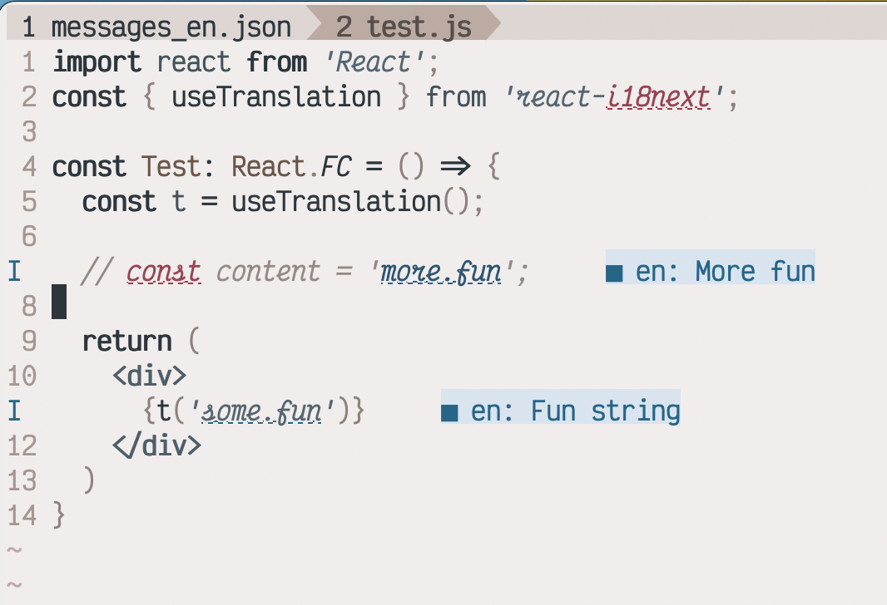

# langd

> **⚠️ DEPRECATED**: This project is no longer maintained. Please use [lang-lsp](https://github.com/daliusd/lang-lsp/) instead, which provides a modern Language Server Protocol implementation with better features and editor support.

Wanna collect language strings fast? Welcome to langd!

This is built on top of [core_d.js](https://github.com/mantoni/core_d.js).

## Installation guide

```
$ npm install -g @daliusd/langd
```

**NOTE**: `npm` comes builtin to [`node`](https://nodejs.org).

Install [`fd`](https://github.com/sharkdp/fd) as this is
requirement to find `messages_en.json` files.

## Using in the command line with node.js

The langd script always takes the file in the standard input and
the optional positional parameter with the root folder:

```
$ cat file.ts | langd /path/to/root
```

## How it works

When you run `langd` then it searches for `messages_en.json` files
in specified root and loads content of `messages_en.json` to
memory. Next time you run `langd` it will get results from memory.

If you add new `messages_en.json` files under your root `langd`
will search them again in 5 minutes. If you need to do it faster
then restart `langd` using `langd restart`.

Files are cached for 60 minutes but they will be reloaded on
modification. If you want to see what files are currently loaded
in memory run `langd status`:

```bash

❯ langd status
Running.

Paths cached by root
--------------------

Root: /home/daliusd/projects/em/packages/fun-react

        - No cached files

Root: /home/daliusd/projects/em/packages/fun-picker

        - /home/daliusd/projects/em/packages/fun-picker/src/assets/locales/messages_en.json
```

## Editor integration

### Neovim with nvim-lint

Here is how I have configured `langd` using
[nvim-lint](https://github.com/mfussenegger/nvim-lint):

```lua
  {
    "mfussenegger/nvim-lint",
    config = function()
      require('lint').linters_by_ft = {
        javascript = { 'langd' },
        javascriptreact = { 'langd' },
        typescript = { 'langd' },
        typescriptreact = { 'langd' },
      }

      vim.api.nvim_create_autocmd({ "BufRead", "InsertLeave" }, {
        callback = function()
          require("lint").try_lint()
        end,
      })

      require('lint').linters.langd = {
        cmd = 'langd',
        stdin = true,
        args = { vim.fn.getcwd() },
        stream = 'stdout',
        parser = require('lint.parser').from_pattern(
          '(%d+):(%d+):(%d+) (.*)',
          { "lnum", "col", "end_col", "message" },
          nil,
          {
            ["source"] = "langd",
            ["severity"] = vim.diagnostic.severity.INFO,
          })
      }
    end
  },
```

### Neovim with null-ls

Here is how it can be integrated with
[null-ls.nvim](https://github.com/jose-elias-alvarez/null-ls.nvim).

NOTE 2023-07-17: null-ls is going to be deprecated so I do not
recommend using it.

```lua
local langd = {
  method = null_ls.methods.DIAGNOSTICS,
  filetypes = { "javascript", "javascriptreact", "typescript", "typescriptreact" },
  generator = null_ls.generator({
    command = "langd",
    args = { vim.fn.getcwd() },
    to_stdin = true,
    format = "line",
    on_output = helpers.diagnostics.from_patterns({
      {
        pattern = [[(%d+):(%d+):(%d+) (.*)]],
        groups = { "row", "col", "end_col", "message" },
        overrides = {
          diagnostic = {
            severity = helpers.diagnostics.severities.information,
          },
        },
      },
    }),
  }),
}

null_ls.register(langd)
```

This should show strings for corresponding keys in Neovim:


